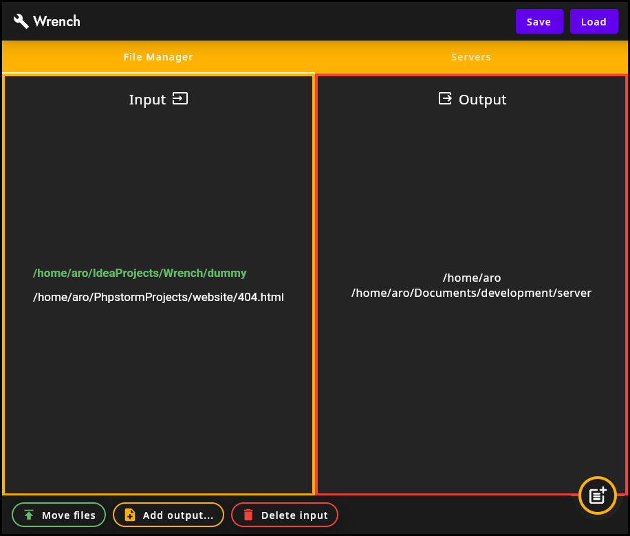

## Wrench: A toolbox for managing files and Minecraft servers from a unified interface

### _**⚠ Warning:**_

_Wrench is very still in early stage and not really user-friendly. Moving files erases the destination
file without asking for confirmation, use at your own risks!_

## Origin

Wrench came from the necessity to have a fast and reliable tool to move files easily.
I'm making Minecraft Plugins, everytime a new build artifact is produced, I found myself digging through folders
manually moving the file from the build folder to the destination one. In the long term that annoyed me, so I've spent
some time making Wrench.

## Why JetPack Compose and Kotlin ?

After using JavaFX for some time, I wanted to move away from Java for Desktop stuff and stumbled upon Jetpack Compose.
It appealed to me for multiple reasons:

* it's written in Kotlin, which I found myself wanting to learn for a while.
* even thought it's pretty early and not really mature, I found declarative UI pretty comprehensive on its own.

## Could it be useful to me?

Probably? If you find yourself like me making Minecraft Plugins or moving a bunch of files over to a predictable
location, you could have a look at Wrench.